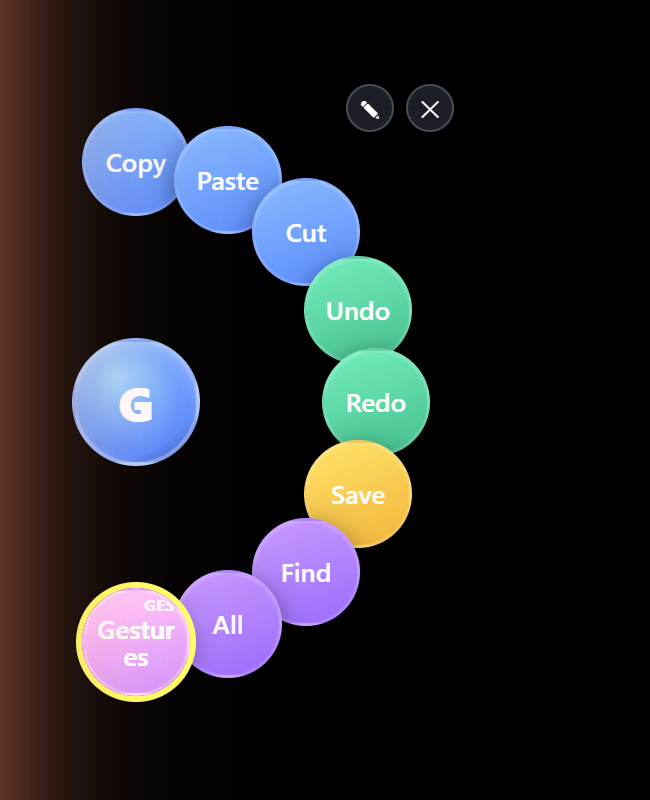
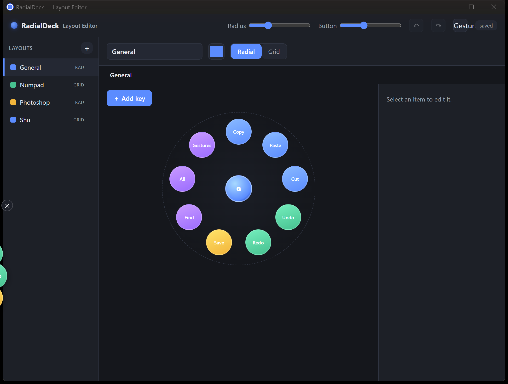
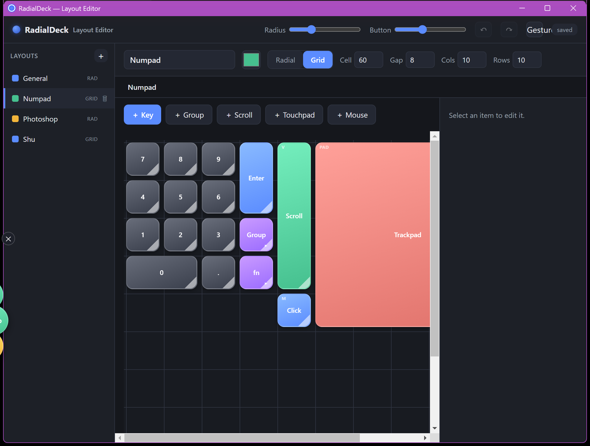
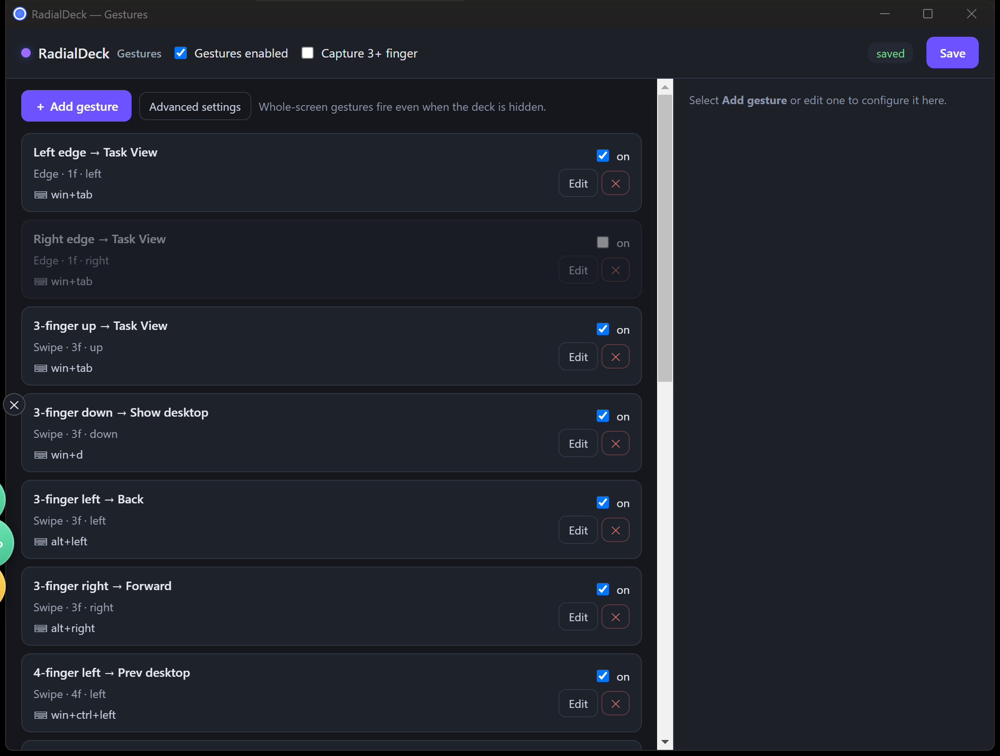
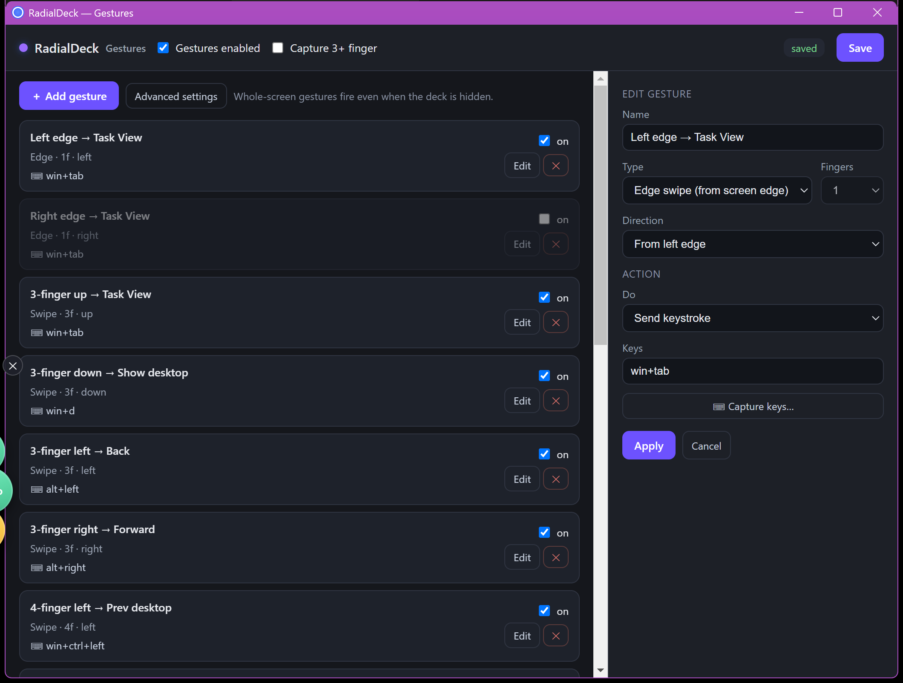

# RadialDeck

A radial / grid **virtual keyboard overlay** for Windows, built with Electron. Float customizable shortcut layouts over any app and fire them by touch, pen, or mouse — a BUGKEY-style on-screen control surface for creators.

 

---

## Screenshots

### Overlay — open on desktop



Tap the orb to open the ring. The **Gestures** button (yellow border) lights up when gesture detection is active.

### Layout Editor — radial layout



### Layout Editor — grid layout



### Gesture Editor — binding list



### Gesture Editor — configure a binding



---

## Features

- **Radial & grid layouts** — a draggable center orb opens a ring of buttons, or a grid/numpad-style pad. Switch layouts on the fly.
- **Sends real synthetic input** — keystrokes, clicks, and mouse-wheel scroll injected into the focused app (Press / Hold / Toggle / Command action models).
- **Drives elevated (UAC) windows with no per-launch prompt** via a split architecture: a normal-integrity Electron renderer talks over a named pipe to a tiny signed C# **UIAccess** injector (`RadialDeckInput.exe`).
- **Touch & pen aware** — suppresses Windows' legacy touch→mouse promotion and pan/flick gestures so a finger-drag on a button doesn't scroll the app underneath.
- **Global touch gesture engine** — whole-screen gesture recognition that fires commands even when the deck is hidden. See [Touch Gestures](#touch-gestures) below.
- **Trackpad widget** — relative cursor control with adjustable speed, pointer acceleration, scroll speed/acceleration, and multi-finger gestures.
- **Rich buttons** — sub-cell (¼-cell) grid sizing, custom colors, ~70 built-in icons or your own images (fit / fill / stretch / padded), and auto-rename from the bound key.
- **Edge-aware** — buttons bend into the work area (half/quarter pie, grid relocate) when the orb sits near a screen edge. DPI-correct on HiDPI/4K.
- **Non-activating overlay** — frameless, transparent, always-on-top, never steals focus.

---

## Touch Gestures

RadialDeck includes a background gesture engine that listens to Raw Input touch data system-wide. Gestures fire even when the overlay is hidden, and they work alongside or independently of the on-screen buttons.

### Supported gesture types

| Type | Description |
|------|-------------|
| **Edge swipe** | Swipe in from the left or right screen edge with 1+ fingers |
| **Multi-finger swipe** | 3, 4, or 5-finger directional swipe (up/down/left/right) |
| **Multi-finger tap** | Quick tap with 3, 4, or 5 fingers |
| **Pinch** | Two-finger pinch in or out |
| **Rotate** | Two-finger clockwise or counter-clockwise rotation |
| **Path — circle** | Draw a circle with one finger |
| **Path — half-circle** | Draw a half-circle (up or down) |
| **Path — S / sideways-S** | Draw an S or mirrored-S shape |
| **Path — figure-8** | Draw a figure-8 |
| **Custom path** | Record any freehand shape and bind it to a command |

### Actions you can bind

- **Send keystroke** — any key combo (e.g. `win+tab`, `ctrl+z`, `alt+F4`)
- **Run command** — launch any executable or shell command
- **RadialDeck control** — open/close the deck, switch to a named layout, toggle gesture mode
- **System actions** — volume up/down/mute, media play/pause/next/prev, show desktop, lock screen

### Default bindings

| Gesture | Default action |
|---------|---------------|
| Left edge swipe | Summon deck (`win+tab`) |
| Right edge swipe | Task View (disabled by default) |
| 3-finger up | Task View (`win+tab`) |
| 3-finger down | Show desktop (`win+d`) |
| 3-finger left | Back (`alt+left`) |
| 3-finger right | Forward (`alt+right`) |
| 4-finger left | Prev desktop (`win+ctrl+left`) |
| 4-finger right | Next desktop (`win+ctrl+right`) |
| 4-finger up | Task View (`win+tab`) |

All defaults can be edited, disabled, or deleted. New bindings are added with **+ Add gesture**.

### How to open the Gesture Editor

- **From the overlay:** open the deck → click the **Gestures** button (or via tray → *Edit gestures…*)
- **From the editor:** click **Gestures** in the top-right of the Layout Editor header

### Enabling / disabling gestures

The **Gestures** button in any radial layout toggles gesture detection on/off. When enabled the button lights up (yellow border + GES badge). You can also toggle it from the Gesture Editor's master checkbox.

### 3+ finger capture mode

When **Capture 3+ finger** is checked in the Gesture Editor, RadialDeck claims all 3-finger-and-above touches system-wide via `RegisterPointerInputTarget` while those fingers are down — other apps won't receive them. Safeguards:

- **Auto-release watchdog:** the capture is automatically released 1.5 s after the last renewal if the host process stops sending renewals (e.g. crash). Touch can never get permanently stuck.
- **Disabled by default.** Enable it in *Edit gestures… → Capture 3+ finger → Save*.
- To release manually: uncheck the option or press the Gestures toggle button.

### Recording a custom gesture

1. Open the Gesture Editor → **+ Add gesture**
2. Set Type to **Custom path**, set Fingers, then click **Record gesture**
3. Draw your shape on the touchscreen — the template is captured and drawn on the canvas
4. Set the action, name the binding, click **Apply → Save**

Custom gestures are matched with the **$P point-cloud recognizer** (order/orientation-insensitive).

### Advanced thresholds

Click **Advanced settings** in the Gesture Editor to tune:

| Setting | Default | What it does |
|---------|---------|--------------|
| Edge margin (px) | 28 | How close to the edge a swipe must start |
| Min swipe distance (px) | 110 | Minimum travel to count as a swipe |
| Tap max movement (px) | 30 | How much drift is allowed in a tap |
| Tap max duration (ms) | 320 | Maximum duration for a tap |
| Rotate min angle (°) | 35 | Minimum rotation to fire rotate gesture |
| Pinch min ratio | 0.72 | Distance ratio threshold for pinch |
| Path min score | 0.80 | $P match confidence threshold (0–1) |
| Cooldown (ms) | 350 | Minimum time between gesture fires |

---

## Installation

Run `dist/RadialDeck-Setup.exe` — a single self-elevating installer that:

1. Stops any running instance
2. Extracts the app to `C:\Program Files\RadialDeck`
3. Creates a self-signed code-signing cert, trusts it, and signs `RadialDeckInput.exe` (required for UIAccess)
4. Creates Start Menu and Desktop shortcuts

> The installer imports a self-signed cert into the machine trust store — this is required for UIAccess (which lets RadialDeck send input into elevated windows and capture multi-finger touches). Review `build/uiaccess-setup.ps1` if you'd like to inspect it before running.

---

## Requirements

- Windows 10 or 11
- [Node.js](https://nodejs.org/) LTS + npm (for development only)
- .NET Framework 4.x (for `csc.exe`, used during packaging — already present on all modern Windows)

---

## Develop

```bash
npm install
npm start        # run the overlay directly via electron .
```

---

## Package & installer

```bash
npm run dist       # build/pack.js → @electron/packager + csc injector → dist/win-unpacked/
npm run installer  # pack + make-installer.js → dist/RadialDeck-Setup.exe
```

The installer is a self-contained C# bootstrapper (`build/setup.cs`) that embeds `dist/win-unpacked` as a zip and runs `build/uiaccess-setup.ps1` post-extract. No electron-builder required.

---

## Architecture

RadialDeck uses a **split-process architecture** to support UIAccess (sending input into elevated windows) without running the entire Electron renderer at high integrity:

```
RadialDeck.exe (normal integrity, Electron)
    │  named pipe  \\.\pipe\RadialDeckInput
    ▼
RadialDeckInput.exe (UIAccess, signed C#)
    │  SendInput / RegisterPointerInputTarget
    ▼
  Target app (any integrity level)
```

- `RadialDeck.exe` renders the UI, handles config, runs the gesture host subprocess
- `RadialDeckInput.exe` receives keystroke/click commands over the pipe and injects them via `SendInput`; also handles `RegisterPointerInputTarget` for multi-finger capture mode
- The gesture host is a PowerShell/C# subprocess that reads Raw Input (HID touch digitizer, usage page 0x0D) and streams contact frames back to Node over stdout

---

## Project layout

| Path | What |
|------|------|
| `src/main.js` | Electron main — windows, IPC, tray, gesture wiring |
| `src/overlay.js` / `overlay.html` / `overlay.css` | Floating overlay UI |
| `src/editor.js` / `editor.html` / `editor.css` | Layout/button editor |
| `src/gestures.js` | Gesture engine — Raw Input host, $P recognizer, capture mode |
| `src/gestures.html` / `gestures-editor.js` | Gesture binding editor UI |
| `src/keyboard.js` | Input dispatch → named-pipe injector |
| `src/store.js` | Config load/save/migrate (`config.json` in userData) |
| `src/icons.js` | Shared built-in SVG icon set |
| `build/injector/RadialDeckInput.cs` | C# UIAccess input injector + capture window |
| `build/pack.js` | Packager script (@electron/packager + csc injector) |
| `build/make-installer.js` | Builds `dist/RadialDeck-Setup.exe` |
| `build/setup.cs` | Self-elevating C# bootstrapper (the installer) |
| `build/uiaccess-setup.ps1` | Post-install: cert creation, signing, shortcuts |

---

## License

MIT
