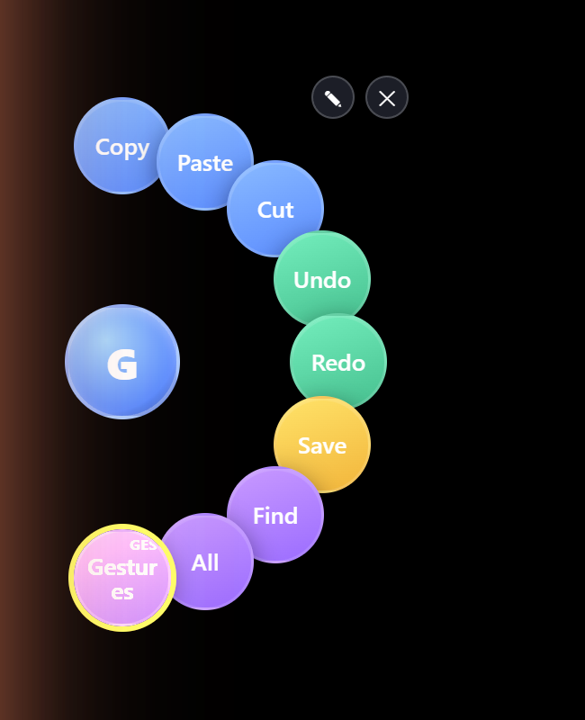
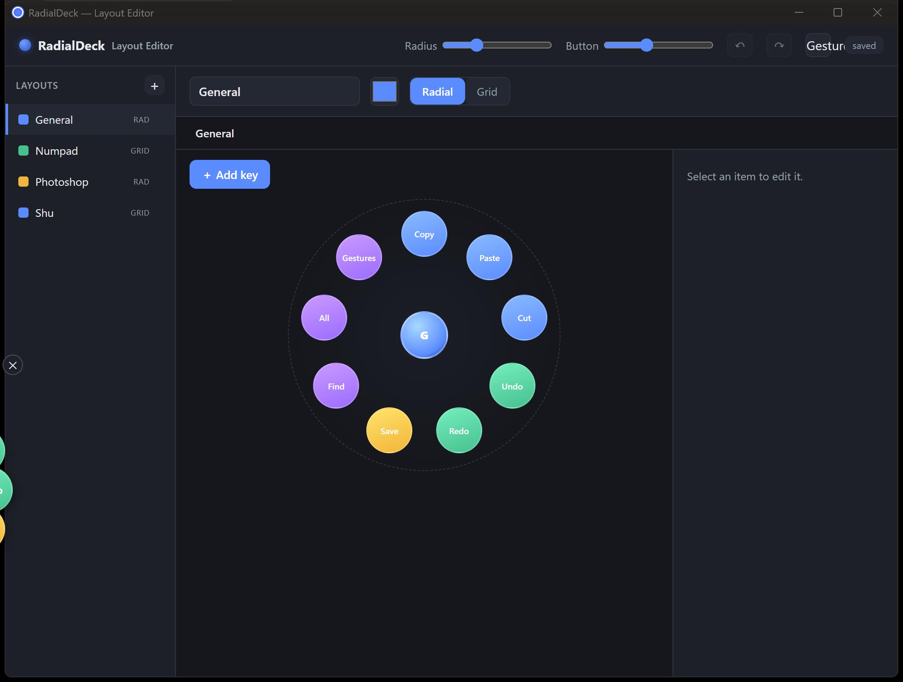
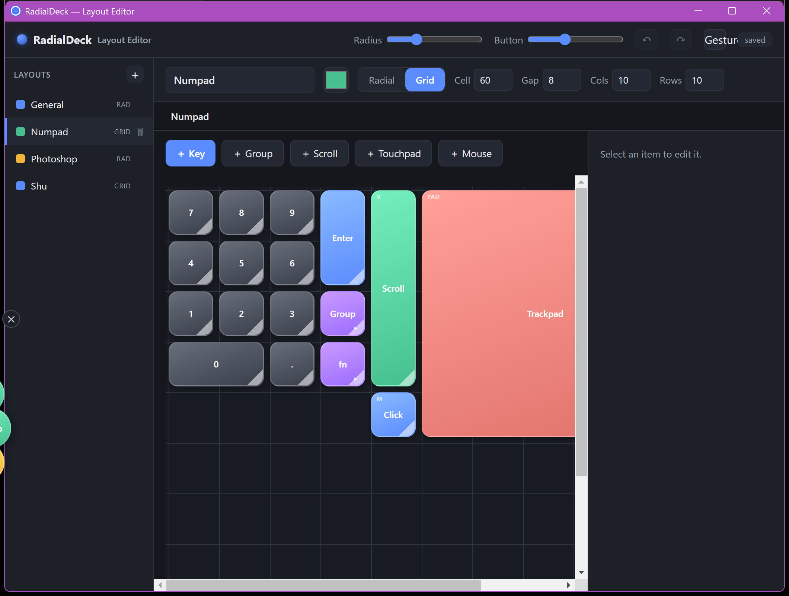
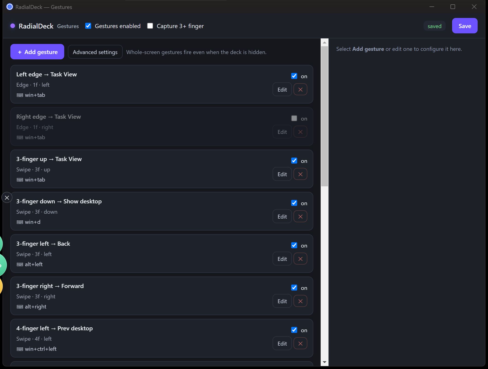
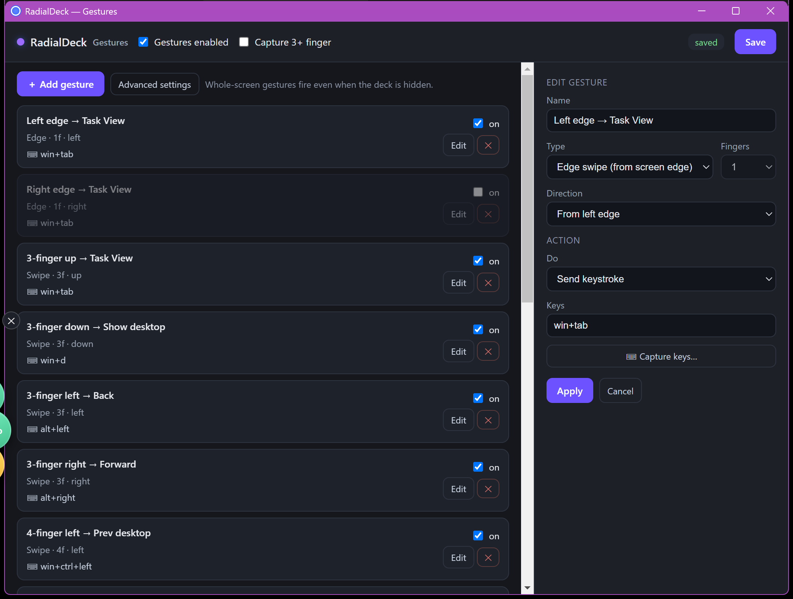

# RadialDeck — Handy Touch Buttons and Multitouch Gesture Overlay for Windows

**RadialDeck** is a free, open-source on-screen **shortcut deck** and **gesture engine** for Windows 10/11 — no phone, no second device, no account, no network. Fire a **radial pie menu** or **grid keypad** of shortcuts by touch, pen or mouse, *and* use whole-screen **multitouch gestures** (edge swipes, 3–5 finger swipes, pinch, rotate, drawn shapes) plus **right-drag mouse gestures** that work even when the deck is hidden. Works over elevated/UAC windows.

Built for **drawing tablet users**, **touchscreen PC users**, **digital artists**, **streamers**, and anyone who wants a [Stream Deck](https://www.elgato.com/stream-deck)-style controller without extra hardware.

  


---

## Screenshots

### Overlay — open on desktop



Tap the orb to open the ring. The **Gestures** button (yellow border) lights up when gesture detection is active.

### Layout Editor — radial layout



### Layout Editor — grid layout



### Gesture Editor — binding list



### Gesture Editor — configure a binding



---

## Features

- **Radial & grid layouts** — a draggable center orb opens a ring of buttons, or a grid/numpad-style pad. Switch layouts on the fly.
- **Sends real synthetic input** — keystrokes, clicks, and mouse-wheel scroll injected into the focused app (Press / Hold / Toggle / Command action models).
- **Drives elevated (UAC) windows with no per-launch prompt** via a split architecture: a normal-integrity Electron renderer talks over a named pipe to a tiny signed C# **UIAccess** injector (`RadialDeckInput.exe`).
- **Touch & pen aware** — suppresses Windows' legacy touch→mouse promotion and pan/flick gestures so a finger-drag on a button doesn't scroll the app underneath.
- **Global touch gesture engine** — whole-screen gesture recognition that fires commands even when the deck is hidden. See [Touch Gestures](#touch-gestures) below.
- **Trackpad widget** — relative cursor control with adjustable speed, pointer acceleration, scroll speed/acceleration, and multi-finger gestures.
- **Rich buttons** — sub-cell (¼-cell) grid sizing, custom colors, ~70 built-in icons or your own images (fit / fill / stretch / padded), and auto-rename from the bound key.
- **Edge-aware** — buttons bend into the work area (half/quarter pie, grid relocate) when the orb sits near a screen edge. DPI-correct on HiDPI/4K.
- **Non-activating overlay** — frameless, transparent, always-on-top, never steals focus.

---

## Touch Gestures

RadialDeck includes a background gesture engine that listens to Raw Input touch data system-wide. Gestures fire even when the overlay is hidden, and they work alongside or independently of the on-screen buttons.

### Supported gesture types

| Type | Description |
|------|-------------|
| **Edge swipe** | Swipe in from the left or right screen edge with 1+ fingers |
| **Multi-finger swipe** | 3, 4, or 5-finger directional swipe (up/down/left/right) |
| **Multi-finger tap** | Quick tap with 3, 4, or 5 fingers |
| **Pinch** | Two-finger pinch in or out |
| **Rotate** | Two-finger clockwise or counter-clockwise rotation |
| **Path — circle** | Draw a circle with one finger |
| **Path — half-circle** | Draw a half-circle (up or down) |
| **Path — S / sideways-S** | Draw an S or mirrored-S shape |
| **Path — figure-8** | Draw a figure-8 |
| **Custom path** | Record any freehand shape and bind it to a command |

### Actions you can bind

- **Send keystroke** — any key combo (e.g. `win+tab`, `ctrl+z`, `alt+F4`)
- **Run command** — launch any executable or shell command
- **RadialDeck control** — open/close the deck, switch to a named layout, toggle gesture mode
- **System actions** — volume up/down/mute, media play/pause/next/prev, show desktop, lock screen

### Default bindings

| Gesture | Default action |
|---------|---------------|
| Left edge swipe | Summon deck (`win+tab`) |
| Right edge swipe | Task View (disabled by default) |
| 3-finger up | Task View (`win+tab`) |
| 3-finger down | Show desktop (`win+d`) |
| 3-finger left | Back (`alt+left`) |
| 3-finger right | Forward (`alt+right`) |
| 4-finger left | Prev desktop (`win+ctrl+left`) |
| 4-finger right | Next desktop (`win+ctrl+right`) |
| 4-finger up | Task View (`win+tab`) |

All defaults can be edited, disabled, or deleted. New bindings are added with **+ Add gesture**.

### How to open the Gesture Editor

- **From the overlay:** open the deck → click the **Gestures** button (or via tray → *Edit gestures…*)
- **From the editor:** click **Gestures** in the top-right of the Layout Editor header

### Enabling / disabling gestures

The **Gestures** button in any radial layout toggles gesture detection on/off. When enabled the button lights up (yellow border + GES badge). You can also toggle it from the Gesture Editor's master checkbox.

### 3+ finger capture mode

When **Capture 3+ finger** is checked in the Gesture Editor, RadialDeck claims all 3-finger-and-above touches system-wide via `RegisterPointerInputTarget` while those fingers are down — other apps won't receive them. Safeguards:

- **Auto-release watchdog:** the capture is automatically released 1.5 s after the last renewal if the host process stops sending renewals (e.g. crash). Touch can never get permanently stuck.
- **Disabled by default.** Enable it in *Edit gestures… → Capture 3+ finger → Save*.
- To release manually: uncheck the option or press the Gestures toggle button.

### Recording a custom gesture

1. Open the Gesture Editor → **+ Add gesture**
2. Set Type to **Custom path**, set Fingers, then click **Record gesture**
3. Draw your shape on the touchscreen — the template is captured and drawn on the canvas
4. Set the action, name the binding, click **Apply → Save**

Custom gestures are matched with the **$P point-cloud recognizer** (order/orientation-insensitive).

### Advanced thresholds

Click **Advanced settings** in the Gesture Editor to tune:

| Setting | Default | What it does |
|---------|---------|--------------|
| Edge margin (px) | 28 | How close to the edge a swipe must start |
| Min swipe distance (px) | 110 | Minimum travel to count as a swipe |
| Tap max movement (px) | 30 | How much drift is allowed in a tap |
| Tap max duration (ms) | 320 | Maximum duration for a tap |
| Rotate min angle (°) | 35 | Minimum rotation to fire rotate gesture |
| Pinch min ratio | 0.72 | Distance ratio threshold for pinch |
| Path min score | 0.80 | $P match confidence threshold (0–1) |
| Cooldown (ms) | 350 | Minimum time between gesture fires |

---

## Coming from StrokesPlus.net?

StrokesPlus.net was retired at the end of 2024 and its site is now an archive. RadialDeck is an actively
maintained option for the same core habit — **hold the right mouse button and draw a shape to run a command**.

| StrokesPlus.net | RadialDeck |
|---|---|
| Right-button drag gestures | Yes — direction strokes and custom drawn shapes |
| Gesture drawing trail | Yes |
| Send keystrokes / launch apps / media keys | Yes |
| Lua scripting | No — bindings are set in a visual editor |
| Per-application gesture sets | Not yet (planned) |
| Touch and pen gestures | Yes — this is RadialDeck's main focus |
| On-screen button deck | Yes — radial or grid |

RadialDeck uses Raw Input rather than a low-level mouse hook, so a slow gesture can't stall the rest of
your desktop.

---

## A maintained gesture alternative for Windows 11

GestureSign has had no new code since 2022 and doesn't support continuous gestures. RadialDeck's pinch,
rotate and swipe actions are continuous — scroll and zoom track your fingers as you move them, rather than
firing once at the end of the stroke.

---

## Numpad emulation for laptops and pen displays

Blender's own *Emulate Numpad* option takes over the 1–0 keys, which are also your collection-visibility
shortcuts. RadialDeck's grid layout gives you Numpad 1/3/7/9/5/0 and `.` as real on-screen buttons instead,
so you keep both — handy on a laptop, a tablet PC, or a pen display where reaching the keyboard breaks
your flow.

---

## An edge keyboard for Windows drawing apps

Clip Studio Paint, Krita, Photoshop and Affinity all reward one-handed modifier keys, and the shortcut bars
that tablet versions of those apps ship don't exist on the desktop. RadialDeck sits at the edge of the
canvas and fills that gap in any of them, with no plugin to install.

---

## Replaces hardware you'd otherwise buy

A dedicated shortcut deck, dial controller, foot pedal or tablet remote typically runs roughly **$50–$550**
depending on model. RadialDeck does the on-screen half of that job for free, using the touchscreen, pen
display or spare tablet you already own.

RadialDeck is not affiliated with, endorsed by, or sponsored by Elgato, Corsair, TourBox, Loupedeck,
Logitech, Huion, Wacom, XP-Pen, Xencelabs, Razer or Contour Design. All product names and trademarks are
the property of their respective owners.

---

## Questions

### Does this work without a keyboard?
Yes. Every button sends its keystroke to whichever app has focus, so a touchscreen-only machine can drive
apps that otherwise need a full keyboard.

### Does it work over admin windows?
Yes. A small signed helper process carries the `uiAccess` privilege so keystrokes reach elevated windows
and UAC prompts. The helper sends input only — it does not log keystrokes and makes no network connections.

### Do I need a phone or a second device?
No. Everything runs on the same PC. There is no companion app, no pairing and no account.

### Does it work with Huion, XP-Pen and Wacom tablets?
Yes, for touch and pen input that Windows reports normally. RadialDeck reads Windows touch and Raw Input,
so it doesn't depend on a particular vendor driver.

### Will it conflict with my app's own touch gestures?
It can. Krita uses a 4-finger tap and Clip Studio Paint uses 2-finger undo / 3-finger redo, and the
whole-screen engine will currently compete with those. Per-app suppression is planned; for now, turn off
the finger counts you don't need in the gesture editor.

### Why does my antivirus flag it?
The installer is not yet signed by a commercial certificate authority, which some scanners treat as
unknown rather than unsafe. The source is here in full, and you can build it yourself with `npm run installer`.

### Can I use it on a spacedesk or Duet second screen?
Yes. Those show up as ordinary monitors with touch digitizers, so you can park the deck there and keep
your main screen clear.

---

## Known limitations

- Keystroke actions need the target app to have focus, so they can't drive a background window.
- Exclusive-fullscreen games bypass the desktop compositor — nothing can draw over them.
- Apps with their own multi-finger gestures will compete with the whole-screen engine until per-app
  suppression ships.
- The installer's helper is self-signed today; a commercial certificate is on the list.

---

## Installation

Run `dist/RadialDeck-Setup.exe` — a single self-elevating installer that:

1. Stops any running instance
2. Extracts the app to `C:\Program Files\RadialDeck`
3. Creates a self-signed code-signing cert, trusts it, and signs `RadialDeckInput.exe` (required for UIAccess)
4. Creates Start Menu and Desktop shortcuts

> The installer imports a self-signed cert into the machine trust store — this is required for UIAccess (which lets RadialDeck send input into elevated windows and capture multi-finger touches). Review `build/uiaccess-setup.ps1` if you'd like to inspect it before running.

---

## Requirements

- Windows 10 or 11
- [Node.js](https://nodejs.org/) LTS + npm (for development only)
- .NET Framework 4.x (for `csc.exe`, used during packaging — already present on all modern Windows)

---

## Develop

```bash
npm install
npm start        # run the overlay directly via electron .
```

---

## Package & installer

```bash
npm run dist       # build/pack.js → @electron/packager + csc injector → dist/win-unpacked/
npm run installer  # pack + make-installer.js → dist/RadialDeck-Setup.exe
```

The installer is a self-contained C# bootstrapper (`build/setup.cs`) that embeds `dist/win-unpacked` as a zip and runs `build/uiaccess-setup.ps1` post-extract. No electron-builder required.

---

## Architecture

RadialDeck uses a **split-process architecture** to support UIAccess (sending input into elevated windows) without running the entire Electron renderer at high integrity:

```
RadialDeck.exe (normal integrity, Electron)
    │  named pipe  \\.\pipe\RadialDeckInput
    ▼
RadialDeckInput.exe (UIAccess, signed C#)
    │  SendInput / RegisterPointerInputTarget
    ▼
  Target app (any integrity level)
```

- `RadialDeck.exe` renders the UI, handles config, runs the gesture host subprocess
- `RadialDeckInput.exe` receives keystroke/click commands over the pipe and injects them via `SendInput`; also handles `RegisterPointerInputTarget` for multi-finger capture mode
- The gesture host is a PowerShell/C# subprocess that reads Raw Input (HID touch digitizer, usage page 0x0D) and streams contact frames back to Node over stdout

---

## Project layout

| Path | What |
|------|------|
| `src/main.js` | Electron main — windows, IPC, tray, gesture wiring |
| `src/overlay.js` / `overlay.html` / `overlay.css` | Floating overlay UI |
| `src/editor.js` / `editor.html` / `editor.css` | Layout/button editor |
| `src/gestures.js` | Gesture engine — Raw Input host, $P recognizer, capture mode |
| `src/gestures.html` / `gestures-editor.js` | Gesture binding editor UI |
| `src/keyboard.js` | Input dispatch → named-pipe injector |
| `src/store.js` | Config load/save/migrate (`config.json` in userData) |
| `src/icons.js` | Shared built-in SVG icon set |
| `build/injector/RadialDeckInput.cs` | C# UIAccess input injector + capture window |
| `build/pack.js` | Packager script (@electron/packager + csc injector) |
| `build/make-installer.js` | Builds `dist/RadialDeck-Setup.exe` |
| `build/setup.cs` | Self-elevating C# bootstrapper (the installer) |
| `build/uiaccess-setup.ps1` | Post-install: cert creation, signing, shortcuts |

---

## License

MIT
